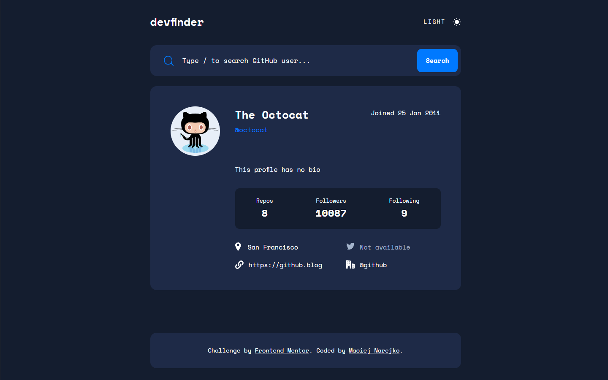

<h1 align="center">GitHub User Search</h1>
<div align="center">
  <h3>
    <a href="https://maciejnarejko.github.io/github-user-search/">
      Live
    </a>
    | 
    <a href="">
      Solution
    </a>
    | 
    <a href="https://www.frontendmentor.io/challenges/github-user-search-app-Q09YOgaH6">
      Challenge
    </a>
  </h3>
</div>



## 📝 About the Project

This project represents an effort to accurately recreate a given design using our preferred technology stack. Utilizing the capabilities of the GitHub API, the application facilitates user searches and showcases the fetched data, mirroring the original design aesthetics.

### Project assumptions:

- The application should display optimally based on the user's device screen size.
- All interactive elements on the page should have defined states for events such as mouse hover.
- Users should be able to search for other GitHub users by their username.
- Upon search, the application should present relevant information about the found user.
- Users should be able to switch between light and dark themes for the application.
- The application should automatically adapt to the preferred color scheme of the user's operating system.

### Additional Assumptions:

- When data is being fetched, users should be presented with a loading effect or animation to indicate that the application is processing their request.
- The application should offer a keyboard shortcut or a feature that allows quick navigation to the "Search" section.
- The application will be covered with unit tests to ensure the correct functionality of key features and components.

## ⚡️ Local Setup

1. Download or clone the repository.
2. Navigate to the project directory in your terminal.
3. Run `npm install` to install all dependencies.
4. Run `npm start` to start the development server.
5. Open a browser and navigate to `http://localhost:3000` to view the app.

## ⚙️ Running Tests

To run the tests, you can use the command `npm test`. This will start the test runner and run all tests in the project. You can also use the command `npm test [path-to-test-file]` to run a specific test file.

## 📂 Folders

```
src/
├──assets/
|   └── ...
├── components/
│   ├── Header/
│   │   ├── Header.tsx
│   │   └── Header.test.tsx
│   │── SearchForm/
│   │   ├── SearchForm.tsx
│   │   └── SearchForm.test.tsx
|   │── SearchUser/
│   │   ├── SearchUser.tsx
│   │   └── SearchUser.test.tsx
|   │── UserDetails/
│   │   ├── UserDetails.tsx
│   │   └── UserDetails.test.tsx
|   └── UserLoading/
│       ├── UserLoading.tsx
│       └── UserLoading.test.tsx
├── context/
|   └── ThemeContext.tsx
├── App.tsx
├── App.test.tsx
├── index.tsx
├── index.css
├── reportWebVitals.tsx
└── setupTests.tsx
```

## 🪚 Built with

### Core:

- **React** - A JavaScript library for building user interfaces.
- **TypeScript** - Superset of JavaScript adding static types.

### Styling:

- **Tailwind CSS** - A utility-first CSS framework.
- **Semantic HTML5 markup** - For better accessibility and SEO.

### Data Handling:

- **Axios** - Promise-based HTTP client.
- **GitHub API** - To fetch user profiles.

### Testing:

- **Jest** - JavaScript testing framework.
- **React Testing Library** - For testing React components.

### Best Practices:

- **Mobile-first workflow** - Designing for mobile platforms before scaling up to larger screens.

## 👨‍💻 Author

**Maciej Narejko**

- Frontend Mentor - [@MaciejNarejko](https://www.frontendmentor.io/profile/MaciejNarejko)
- GitHub - [@MaciejNarejko](https://github.com/maciejnarejko)
- LinkedIn - [@Maciej-Narejko](https://www.linkedin.com/in/maciej-narejko)

## 💖 Acknowledgments

Thanks to the FrontendMentor.io community for a code review.
Together we create better code.
